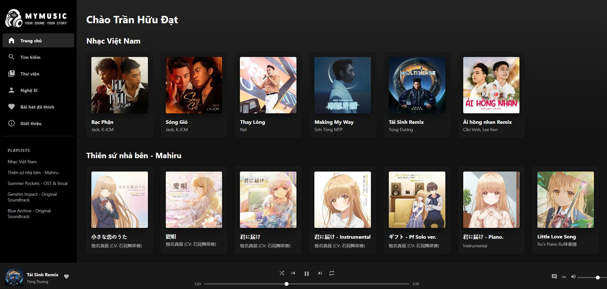
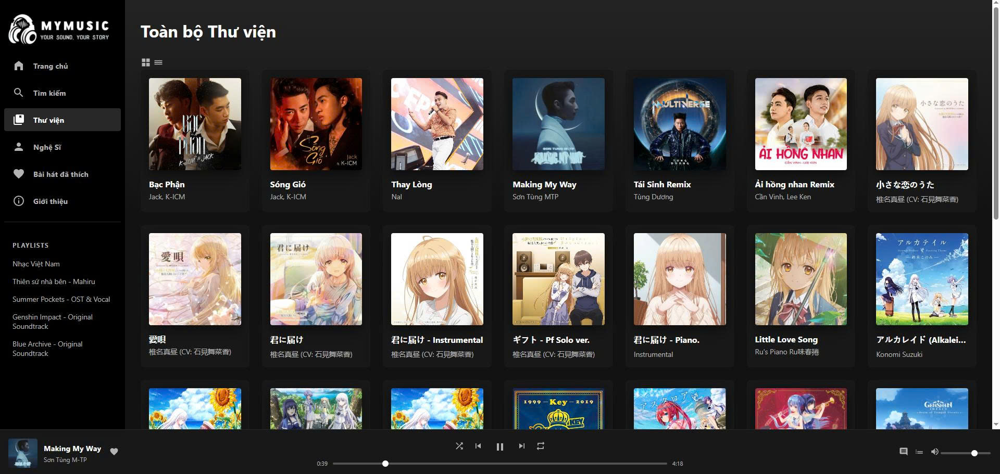
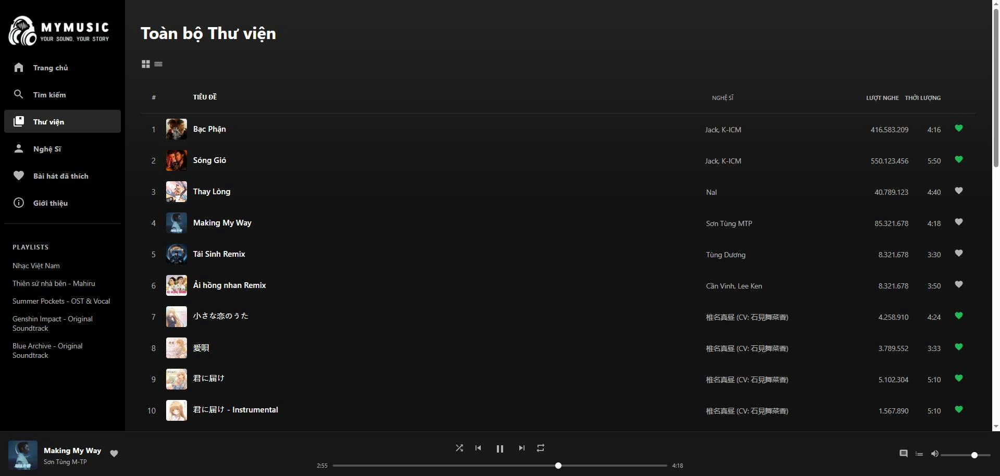
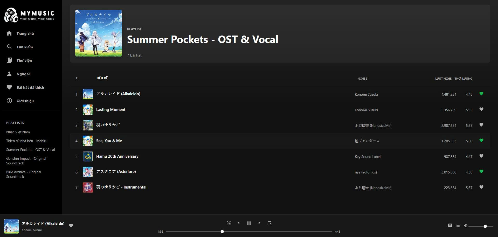
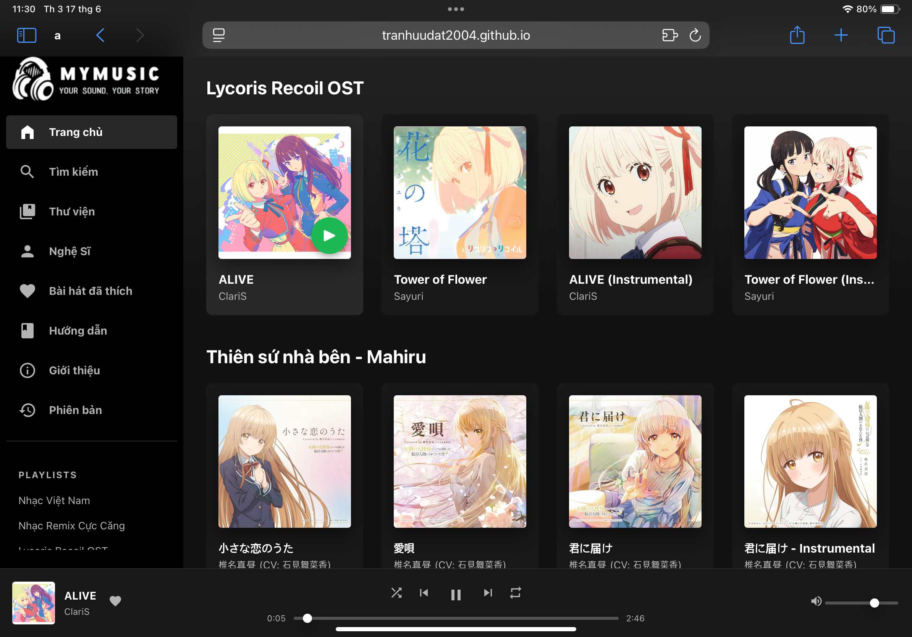
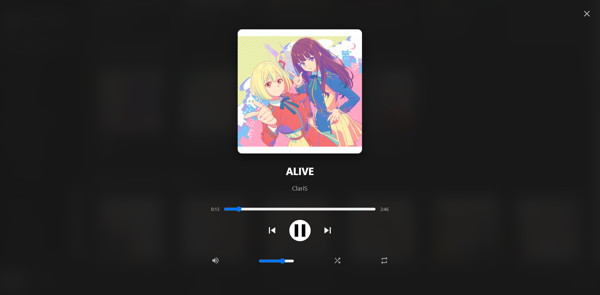
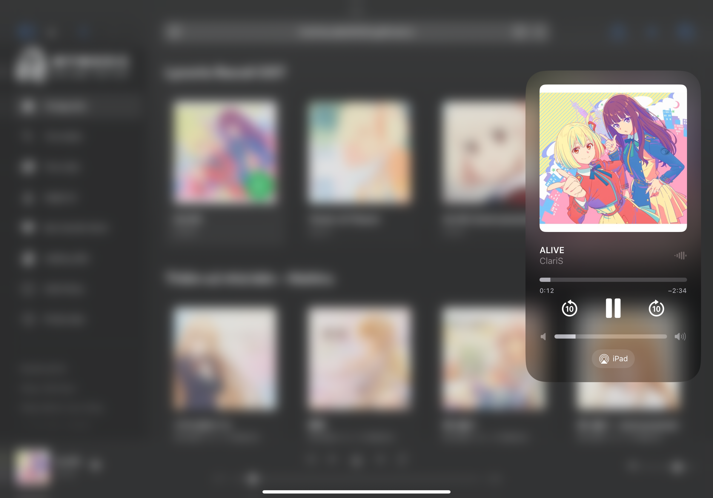

<div align="center">

# MyMusic Player - A Modern Web-Based Music Interface
*Giao diện trình phát nhạc hiện đại trên nền tảng web*

</div>

<p align="center">
  <a href="https://tranhuudat2004.github.io/mymusic/" target="_blank">
    
  </a>
  <a href="https://github.com/TranHuuDat2004/mymusic/releases/latest" target="_blank">
    
  </a>
</p>

---

<details>
<summary><strong> Tiếng Việt (Nhấn để xem)</strong></summary>



MyMusic Player là một giao diện trình phát nhạc trực tuyến được thiết kế và phát triển nhằm mang đến trải nghiệm nghe nhạc đơn giản, hiện đại và trực quan, lấy cảm hứng từ các nền tảng phổ biến như Spotify.

**Bản dùng thử trực tiếp:** [**https://tranhuudat2004.github.io/mymusic/**](https://tranhuudat2004.github.io/mymusic/)

### ✨ Tính Năng Nổi Bật

*   **🎧 Trải nghiệm Nghe nhạc Toàn diện:**
    *   **Trình phát nhạc đầy đủ chức năng:** Phát, tạm dừng, tua nhạc, điều khiển âm lượng, lặp lại (tất cả/một bài), và phát ngẫu nhiên.
    *   **Giao diện "Now Playing" toàn màn hình:** Một giao diện đắm chìm, đồng bộ hoàn hảo với thanh phát nhạc chính.
*   **📱 Tích hợp Hệ thống (Native Integration):**
    *   **Media Session API:** Điều khiển nhạc trực tiếp từ Màn hình khóa, Trung tâm điều khiển (iOS/Android) và các thiết bị phần cứng (như tai nghe). Ảnh bìa và thông tin bài hát được hiển thị đẹp mắt trên toàn hệ thống.
    *   **Favicon & Tiêu đề Động:** Favicon và tiêu đề tab trình duyệt tự động cập nhật theo bài hát đang phát.
*   **🎨 Giao diện Hiện đại & Đáp ứng (Responsive):**
    *   Thiết kế gọn gàng, trực quan và hoạt động tối ưu trên mọi kích thước màn hình, từ máy tính để bàn đến thiết bị di động.
*   **✨ Tương tác Động:**
    *   Được xây dựng hoàn toàn bằng **JavaScript thuần (Vanilla JS)** để tạo ra các yếu tố giao diện động và phản hồi mượt mà.

### 🛠️ Công Nghệ Sử Dụng

*   **HTML5:** Cung cấp cấu trúc ngữ nghĩa cho trang web.
*   **CSS3:** Định dạng giao diện, sử dụng Flexbox, Grid Layout và Biến CSS (Custom Properties).
*   **JavaScript (ES6+):** Xử lý toàn bộ logic ứng dụng, tương tác người dùng, và quản lý trạng thái. Dự án được xây dựng **không sử dụng framework/thư viện** để tập trung vào kỹ năng JS cốt lõi.
*   **Hosting:** Triển khai dưới dạng trang web tĩnh qua [GitHub Pages](https://tranhuudat2004.github.io/mymusic/).

### 📜 Phạm Vi và Giới Hạn

MyMusic Player là một **ứng dụng web tĩnh** và hoạt động hoàn toàn phía client (trình duyệt). Do đó, dự án có các giới hạn sau:
*   **Dữ liệu tĩnh:** Danh sách bài hát được định nghĩa sẵn trong mã nguồn.
*   **Không có tính năng phía máy chủ:** Không có cơ sở dữ liệu, đăng nhập người dùng, hay lưu trữ playlist trên server.
*   **Hoạt động độc lập:** Trạng thái nghe nhạc không được đồng bộ hóa giữa các thiết bị.

Các giới hạn này phản ánh bản chất của một dự án front-end tập trung vào việc trình diễn kỹ năng thiết kế giao diện và tương tác phía client.

### 🚀 Bắt đầu

1.  **Dùng thử trực tiếp:** Cách dễ nhất là truy cập bản demo tại: [**https://tranhuudat2004.github.io/mymusic/**](https://tranhuudat2004.github.io/mymusic/)
2.  **Cài đặt tại máy:**
    *   Clone repository này:
        ```bash
        git clone https://github.com/TranHuuDat2004/mymusic.git
        ```
    *   Mở file `index.html` trong trình duyệt của bạn.

---
</details>

<details open>
<summary><strong> English (Click to view)</strong></summary>


MyMusic Player is an online music player interface designed and developed to provide a simple, modern, and intuitive music listening experience, inspired by popular platforms like Spotify.

**Live Demo:** [**https://tranhuudat2004.github.io/mymusic/**](https://tranhuudat2004.github.io/mymusic/)

### ✨ Key Features

*   **🎧 Comprehensive Listening Experience:**
    *   **Full-Featured Player:** Play, pause, seek, volume control, repeat (all/one), and shuffle functionalities.
    *   **"Now Playing" Fullscreen Mode:** An immersive interface, perfectly synchronized with the main player bar.
*   **📱 Native Integration:**
    *   **Media Session API:** Control your music directly from the Lock Screen, Control Center (iOS/Android), and hardware devices (like headphones). Album art and track metadata are beautifully displayed system-wide.
    *   **Dynamic Favicon & Title:** The browser tab's favicon and title dynamically update to reflect the currently playing song.
*   **🎨 Modern & Responsive Design:**
    *   A clean, intuitive interface that functions optimally across all screen sizes, from desktop to mobile.
*   **✨ Dynamic Interaction:**
    *   Built entirely with **Vanilla JavaScript** to create dynamic UI elements and smooth user interactions.

### 🛠️ Technology Stack

*   **HTML5:** Provides the semantic structure for the web page.
*   **CSS3:** Styles the interface, including modern layout techniques like Flexbox, Grid Layout, and CSS Custom Properties.
*   **JavaScript (ES6+):** Handles all application logic, user interactions, and state management. This project was built **without relying on external frameworks/libraries** to focus on core JS capabilities.
*   **Hosting:** Deployed as a static website via [GitHub Pages](https://tranhuudat2004.github.io/mymusic/).

### 📜 Scope and Limitations

MyMusic Player is a **static web application** and operates entirely on the client-side. Due to this, it has the following limitations:
*   **Static Data:** Song lists are hardcoded within the JavaScript source.
*   **No Server-Side Features:** No database, user login, or server-side playlist storage.
*   **Standalone Operation:** Listening status is not synchronized across devices.

These limitations are inherent to a front-end project focused on demonstrating client-side UI/UX and interaction design.

### 🚀 Getting Started

1.  **Live Demo:** The easiest way to experience MyMusic Player is through the live demo: [**https://tranhuudat2004.github.io/mymusic/**](https://tranhuudat2004.github.io/mymusic/)
2.  **Local Setup:**
    *   Clone the repository:
        ```bash
        git clone https://github.com/TranHuuDat2004/mymusic.git
        ```
    *   Open the `index.html` file in your web browser.

---
</details>

### 🖼️ Screenshots

| **Card View** | **List View** |  **Playlist View**  |
| :---: | :---: |:---: |
|  |  |  |
| **Card View (iPadOS)** | **Fullscreen Player** | **Media Session (iPadOS)** |
|  |   |  |


### 🧑‍💻 Developer

This project was developed by **Trần Hữu Đạt**.

*   **GitHub Profile:** [@TranHuuDat2004](https://github.com/TranHuuDat2004)
*   **Portfolio:** [tranhuudat2004.github.io](https://tranhuudat2004.github.io/)

---

<p align="center">
  Thank you for taking the time to learn about MyMusic Player!
</p>